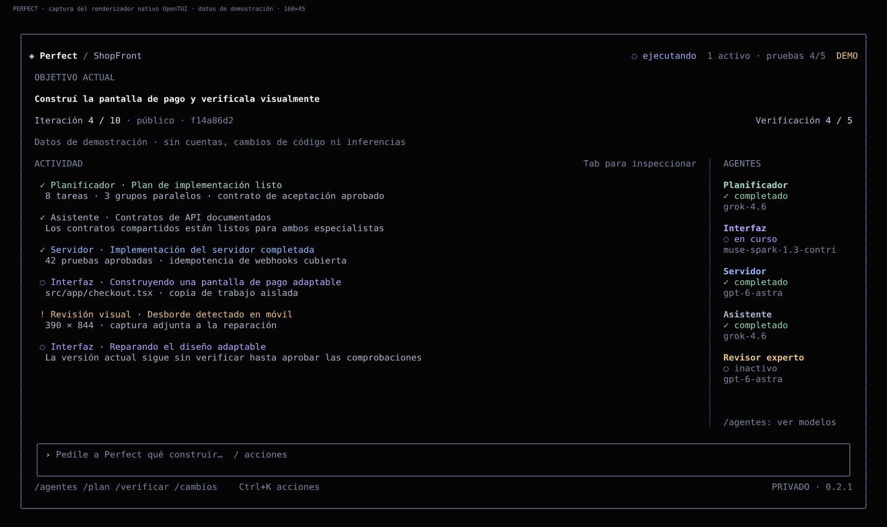

# Perfect Harness

**Construí hasta que la evidencia demuestre que está listo.**

Agentes de programación locales sobre Pi SDK, con una interfaz de terminal reactiva, diseñada para el teclado y con estética de vidrio negro. Describí un objetivo, revisá el plan, observá el trabajo de los especialistas y aceptá el resultado solo después de aprobar las verificaciones.

## Versión 0.2.1 · Español

La interfaz, la ayuda, las acciones, las confirmaciones y el instalador se presentan en español. Los comandos originales siguen funcionando. Los nombres de modelos y proveedores, niveles de razonamiento, claves JSON, identificadores, código, rutas y evidencia original no se traducen ni se sustituyen.



Esta imagen proviene del renderizador real de la aplicación, con datos deterministas identificados como **DEMO**. No es una imagen generada ni demuestra actividad de cuentas personales. El concepto de vidrio es una referencia de diseño: las celdas de una terminal no pueden dibujar refracciones arbitrarias de píxeles. Las capturas históricas de la versión anterior se conservan por separado con su procedencia.

## Instalación

La V2 está en `feat/perfect-harness-v2-tui-windows`. Se conservan la V1 y su solicitud de revisión independiente.

### Windows 11 x64

Descargá el archivo de instalación de una ejecución exitosa del flujo **Windows package**, verificando el commit y la versión elegidos. El paquete contiene `Perfect-Harness-Setup-x64.exe`, un ZIP portable completo y las sumas de verificación SHA256. La versión 0.2.1 usa el instalador en español.

La instalación es por usuario, sin privilegios de administrador. Incluye icono, acceso en Inicio, acceso opcional al escritorio y un perfil independiente de Windows Terminal. La integración con el PATH es opcional y reversible. Node está incluido: no hace falta instalarlo globalmente. Extraé el ZIP completo; `Perfect.exe` es un iniciador nativo pequeño y necesita los archivos que lo acompañan.

Windows Terminal es necesario para abrir la ventana visual dedicada. Git y un motor de Docker capaz de ejecutar contenedores Linux siguen siendo necesarios para trabajar sobre código real. No se instalan silenciosamente ni se reducen las protecciones del entorno aislado. El ejecutable y el instalador **no tienen firma Authenticode**. Consultá [instalación, compilación y validación en Windows](docs/windows.md).

### Desde el código fuente

Usá Node **26.4.0** de la serie 26.x y Git:

```sh
git clone --branch feat/perfect-harness-v2-tui-windows https://github.com/vellxw/Perfect-harness.git
cd Perfect-harness
npm ci
npm run build
npm link
perfect
```

OpenTUI requiere FFI experimental en Node. La entrada lo habilita para la interfaz y el iniciador de Windows proporciona ese parámetro. Pi sigue fijado en 0.85.1. SQLite utiliza `node:sqlite` y conserva el formato de la base de datos de V1. La traducción no migra ni borra tus proyectos, cuentas o estado local.

## Primeros pasos

Abrí `perfect`. El diagnóstico inicial te orienta para conectar las cuentas. Escribí lo que querés construir y presioná Enter. Los objetivos son privados por defecto. Cuando el plan esté listo, revisá `/plan`, aprobalo con `/aprobar` y continuá con `/reanudar`.

Para seleccionar tu proyecto:

```powershell
perfect --carpeta "C:\Proyectos\Mi aplicación"
```

Dentro de la interfaz también podés usar `/carpeta` seguido de la ruta. Para explorarla sin cuentas ni cambios en tu código:

```sh
perfect --demo running
perfect --demo repair
perfect --demo done
```

Los nombres de estos escenarios son identificadores técnicos; su contenido se muestra en español. Las demostraciones están marcadas **DEMO**. Ver un nombre de modelo no demuestra acceso a una cuenta: eso se comprueba mediante una prueba real y explícita después de conectar el proveedor.

## Proveedores

| Rol visible | Ruta configurada | Razonamiento literal |
|---|---|---|
| Planificador | `xai/grok-4.6` | `xhigh` |
| Asistente / integrador | `xai/grok-4.6` | `medium` |
| Interfaz | `opencode/muse-spark-1.3-contributor-free` | `xhigh`, no Max |
| Servidor | `openai-codex/gpt-6-astra` | `high` |
| Revisor experto | `openai-codex/gpt-6-astra` | `xhigh`, solo lectura |

```sh
perfect conectar xai
perfect conectar openai-codex
perfect conectar opencode
perfect diagnostico --en-linea
perfect prueba --permitir-contributor
```

Las claves API y autorizaciones OAuth se introducen localmente. Nunca deben copiarse a GitHub. Contributor exige consentimiento explícito por carpeta y contenido público; los mensajes y respuestas pueden utilizarse para entrenamiento. `/contribuir` lo explica antes de pedir autorización. `/publico` solo afecta al próximo objetivo y no autoriza por sí mismo a compartirlo. `/contribuir revocar` revoca el consentimiento para futuras solicitudes; no retira información ya enviada.

No hay cambios silenciosos de modelo ni de modalidad de cobro. Consultá [autenticación](docs/authentication.md) y [compatibilidad de proveedores](docs/provider-compatibility.md). Las instrucciones o errores externos que un proveedor emita sin traducción se conservan para no ocultar información relevante.

## Controles de la terminal

| Acción | Control |
|---|---|
| Enviar un objetivo | Enter |
| Nueva línea | Shift+Enter cuando se admite; Ctrl+J como alternativa |
| Buscar comandos | `/` |
| Acciones rápidas | Ctrl+K |
| Inspeccionar actividad | Tab, flechas y Enter |
| Agentes / plan / verificación / cambios | Alt+A / Alt+P / Alt+V / Alt+D |
| Cerrar un panel | Escape |
| Salir de forma segura | `/salir` o Ctrl+C; primero se pausa el trabajo activo |

`/agentes`, `/plan`, `/tareas`, `/verificar`, `/archivos`, `/cambios`, `/modelos`, `/consumo`, `/registros`, `/diagnostico` y `/ajustes` muestran los detalles sin llenar la pantalla de paneles permanentes. En archivos, Enter inspecciona texto verificado, O abre una imagen o video verificado y C copia su ruta. Los demás formatos no se ejecutan automáticamente.

Las operaciones sensibles requieren escribir una confirmación: `APROBAR`, `APLICAR`, `CANCELAR` o `COMPARTIR`, según la acción. Un Enter vacío no concede permiso. La autorización sigue vinculada al plan o versión exactos. Un nivel de razonamiento no informado sigue siendo desconocido. La iteración es un contador de límites, no un porcentaje estimado de avance. La interfaz se adapta al ancho y conserva el uso por teclado en 80×24.

La CLI tradicional también está disponible en español:

```sh
perfect estado
perfect estado --json
perfect --sin-interfaz objetivo "Construí la funcionalidad"
perfect pausar
perfect reanudar
perfect cambios
perfect aplicar --si
perfect ayuda
```

Para aprobar un plan desde la CLI usá `perfect aprobar-plan`; `perfect aprobar <id-criterio>` conserva la aprobación de un criterio humano individual. Dentro de la interfaz, `/aprobar` abre la revisión del plan.

Los nombres originales (`goal`, `status`, `agents`, `resume`, `doctor`, entre otros) y sus opciones originales siguen funcionando. `--json` conserva las claves y estados del protocolo: por ejemplo, `DONE` continúa siendo `DONE` en JSON, aunque la interfaz muestre «completado». La interfaz es un cliente del mismo motor, no un segundo evaluador. [Arquitectura de la interfaz](docs/tui-architecture.md).

## Funcionamiento

```text
objetivo → exploración → plan → grafo de tareas → agentes aislados
         → integración → verificación real → revisión independiente
         → evaluador de evidencia → reparación / nuevo plan / pausa / completado
```

La carpeta original se conserva intacta. Las copias de trabajo tienen áreas asignadas, los comandos se ejecutan en contenedores aislados y la evidencia se vincula a una revisión concreta. El controlador, no un modelo que diga «terminé», decide cuándo se cumple el objetivo. Aplicar los cambios requiere autorización y comprobación de divergencias. [Arquitectura](docs/architecture.md), [ciclo de objetivos](docs/goal-loop.md), [recuperación](docs/recovery.md).

## Seguridad

No se ejecutan comandos directamente en el equipo como alternativa a un Docker ausente. No se incluyen secretos en el contexto ni se publican cambios remotos desde los objetivos por defecto. La interfaz no puede escribir `DONE` ni modificar las rutas de los modelos. Las credenciales se enmascaran y solo viajan por comunicación local privada. Abrir un archivo requiere validar su hash y tipo. [Modelo de seguridad](SECURITY.md).

Tener un ejecutable no elimina los requisitos de Git, Docker y acceso a proveedores. Acrylic y Mica dependen de Windows Terminal; las celdas no ofrecen desenfoque por píxel. No se utiliza Electron, Tauri, una interfaz web ni un servicio de servidor nuevo.

## Verificación y desarrollo

```sh
npm run typecheck
npm run lint
npm run check:config
npm test
npm run build
npm run test:package
node --experimental-ffi scripts/capture-tui.mjs
node --experimental-ffi scripts/benchmark-tui.mjs
```

La matriz nativa comprueba Linux y Windows, incluyendo sesiones del SDK real de Pi con transporte simulado y el renderizador real de OpenTUI. Los casos de Docker ejecutan por separado el ciclo integral de reservas y reparación visual, y el renderizado de Remotion. No se utilizan cuentas personales en CI.

La localización añade pruebas de comandos españoles y originales, texto con tildes y eñes, confirmaciones, metadatos intactos y pantallas en español. Los informes distinguen la latencia del renderizador de la latencia completa del escritorio. Los datos de demostración no equivalen a inferencias reales, y Windows Server 2025 no equivale a una prueba personal de Windows 11.

[Dirección de diseño](docs/design/perfect-v2.md) · [Capturas y procedencia](docs/screenshots/README.md) · [Windows](docs/windows.md) · [Contribuciones](CONTRIBUTING.md).
