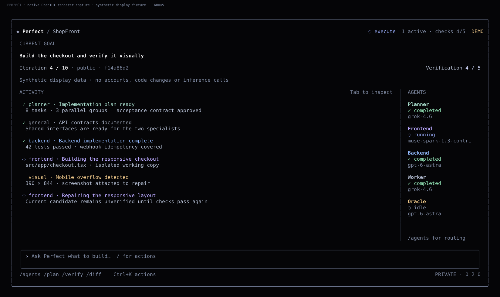

# Perfect Harness

**Build until the evidence says done.**

A local coding harness built on Pi SDK, with a reactive, keyboard-first black-glass terminal interface. Describe a goal, inspect the plan, watch specialized agents work, and accept a result only after the evidence checks pass.



This image is produced by the real TUI renderer with deterministic demonstration data. It is not a generative mockup and does not claim authenticated model activity. The pixel-glass concept is a design reference, not a promise that a terminal can draw arbitrary refraction.

## Install

The V2 implementation is on `feat/perfect-harness-v2-tui-windows`. V1 and its separate PR are preserved.

### Windows 11 x64

Download the `Perfect-Harness-Windows-x64` artifact from a successful **Windows package** workflow for the desired commit. It contains `Perfect-Harness-Setup-x64.exe`, a portable ZIP and SHA256 checksums.

The installer is per-user and does not require administrator privileges. It installs the icon, desktop/Start-menu launch experience and a separate Windows Terminal fragment. PATH integration is optional and reversible. Node is bundled; a global Node installation is not required. The ZIP must be extracted in full: `Perfect.exe` is a small native launcher, not a single-file copy of all dependencies.

Install Windows Terminal for the visual window. Git and a working Docker Linux-container engine are still required for real coding execution; the installer does not silently enable virtualization, install Docker or relax sandbox rules. The launcher and installer are **unsigned** until a publisher supplies an Authenticode certificate. See [Windows packaging and validation](docs/windows.md).

### From source

Use Node **26.4.0** (26.x) and Git:

```sh
git clone --branch feat/perfect-harness-v2-tui-windows https://github.com/vellxw/Perfect-harness.git
cd Perfect-harness
npm ci
npm run build
npm link
perfect
```

OpenTUI's Node runtime needs experimental FFI. The entry point enables that flag for the TUI only; the packaged Windows launcher supplies it. Pi remains pinned to 0.85.1. The SQLite adapter uses `node:sqlite` and keeps the V1 database format.

## Quick start

Open `perfect`. First-run diagnostics help you connect accounts. Type a goal in the composer; Enter submits it. Goals are private by default. When the plan is ready, inspect `/plan`, then `/approve`, then `/resume`.

Try the interface without accounts or code changes:

```sh
perfect --demo running
perfect --demo repair
perfect --demo done
```

These are clearly marked **DEMO**. To verify real account access, use the separate provider smoke tests after login; seeing a model name in the UI does not prove access.

## Providers

| Role | Configured route | Reasoning |
|---|---|---|
| Planner | `xai/grok-4.6` | `xhigh` |
| General / integrator | `xai/grok-4.6` | `medium` |
| Frontend | `opencode/muse-spark-1.3-contributor-free` | `xhigh`, not Max |
| Backend | `openai-codex/gpt-6-astra` | `high` |
| Oracle | `openai-codex/gpt-6-astra` | `xhigh`, read-only |

```sh
perfect login xai
perfect login openai-codex
perfect login opencode
perfect doctor --online
perfect smoke --allow-contributor
```

OAuth and API keys are entered locally. Credentials never belong in GitHub. Contributor requires explicit per-workspace consent and public code; it may allow prompts/responses to be used for training. `/contributor` explains this before authorization. `/public` affects only the next goal; it does not silently authorize sharing. No model or billing fallback is silent. See [authentication](docs/authentication.md) and [provider compatibility](docs/provider-compatibility.md).

## Terminal controls

| Action | Control |
|---|---|
| Submit a goal | Enter |
| New line | Shift+Enter when supported; Ctrl+J portable alternative |
| Browse commands | `/` |
| Quick actions | Ctrl+K |
| Inspect activity | Tab, arrows, Enter |
| Agents / plan / verification / diff | Alt+A / Alt+P / Alt+V / Alt+D, or slash commands |
| Close a panel | Escape |
| Exit safely | `/exit` or Ctrl+C; active work pauses first |

`/agents`, `/plan`, `/tasks`, `/verify`, `/artifacts`, `/diff`, `/routing`, `/cost`, `/logs`, `/doctor` and `/settings` expose detail without permanent dashboard clutter. In artifacts, Enter inspects verified text, O opens verified image/video, and C copies the verified path. Other artifact formats are not auto-executed.

Destructive actions require a typed confirmation. Approvals are tied to the exact plan/candidate. Unknown reasoning metadata remains unknown. Iterations are limits, not percentage-complete estimates. The agent rail collapses as the terminal narrows; 80x24 remains keyboard-usable.

The traditional CLI is preserved:

```sh
perfect status
perfect status --json
perfect --no-ui goal "Build the feature"
perfect pause
perfect resume
perfect diff
perfect apply --yes
```

The TUI is a client of the same engine, not a second Judge. [TUI architecture](docs/tui-architecture.md) explains the event and IPC boundaries.

## How it works

```text
goal → discovery → plan → task DAG → isolated workers
     → integration → real verification → independent review
     → evidence Judge → repair / replan / pause / DONE
```

The original checkout is preserved. Managed worktrees have explicit ownership, commands run in isolated containers, evidence is bound to a specific revision, and the controller—not an LLM saying “finished”—decides DONE. Apply is explicit and checks for divergence. [Architecture](docs/architecture.md), [goal loop](docs/goal-loop.md), [recovery](docs/recovery.md).

## Security

No host-shell fallback, no secrets in context, no remote push from product goals by default. The UI cannot write DONE or modify model bindings. Sensitive input is masked and sent only through private local IPC. Opening an artifact requires hash validation and a restricted media type. [Security model](SECURITY.md), [SECURITY.md](SECURITY.md).

An executable does not remove the need for Git/Docker/provider access. Windows Terminal owns Acrylic/Mica; terminal cells do not provide pixel-level blur. No Electron, Tauri, browser dashboard or new backend service is used.

## Verification and development

```sh
npm run typecheck
npm run lint
npm run check:config
npm test
npm run build
npm run test:package
node --experimental-ffi scripts/capture-tui.mjs
node --experimental-ffi scripts/benchmark-tui.mjs
```

The native matrix tests Linux and Windows, including real Pi SDK against controlled fake provider transport and the actual OpenTUI renderer. Docker end-to-end tests separately execute the fullstack repair loop and Remotion render. No personal providers run in CI. Benchmark reports distinguish explicit native-renderer latency from end-to-end desktop latency.

[Design direction](docs/design/perfect-v2.md) · [Captures](docs/screenshots/README.md) · [Windows](docs/windows.md) · [Contributing](CONTRIBUTING.md).
