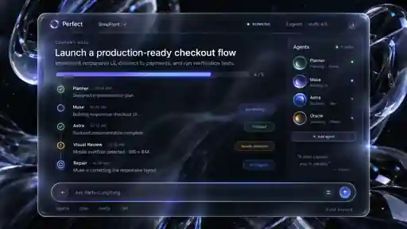

# Perfect V2: dirección aprobada y adaptación a terminal

La referencia es la segunda imagen minimalista de vidrio negro aprobada en la conversación de diseño (`panel_futurista_de_agentes_de_ia.png`). La imagen superior es una copia WebP de 512 píxeles de ese diseño, no una captura del programa. El original tenía 1672×941 píxeles. Orienta la composición y el material; no supone que una terminal pueda reproducir refracción por píxel.

## Composición

Una superficie principal, encabezado breve, objetivo actual, actividad cronológica, una columna estrecha de agentes a partir de 130 columnas y un campo de escritura siempre abajo. En anchos medios, los agentes se muestran en una franja; en 80×24 sus detalles están disponibles en `/agentes`. Sin barra lateral izquierda, paneles administrativos, medidores de CPU o memoria ni frases decorativas.

Cuatro iteraciones de diez es un contador de presupuesto, no un 40 % de avance. Las verificaciones corresponden a la versión candidata actual. Los asistentes concurrentes del mismo rol mantienen registros separados, y la etiqueta del rol nunca sustituye la identidad real de un modelo.

## Material

Obsidiana `#050507`, grafito elevado `#131823`, bordes grises fríos y finos, lavanda moderado `#9AAEFF` y texto casi blanco `#F5F5F7`. El fondo principal puede utilizar la transparencia de la terminal. Los paneles superpuestos mantienen suficiente opacidad para leerse.

Windows Terminal controla Acrylic y el fondo original opcional. Mica es un ajuste personal de ventana; el instalador no lo modifica globalmente. La cuadrícula no reproduce la geometría libre ni los tamaños tipográficos variables de la referencia. Es una adaptación a terminal, no una equivalencia de píxeles.

## Animación

Entrada de paneles con aceleración cúbica suave de 140 ms, indicadores braille actualizados cada 100 ms mientras hay trabajo y modos reducido o desactivado. No se necesita una animación permanente de fondo cuando el motor está inactivo. El estado de transición solo afecta a la presentación. Un indicador girando no demuestra avance del modelo. La animación es independiente del planificador de tareas y no impone una espera artificial antes de escribir.

## Identidad

Cuatro trayectorias curvas convergen en un nodo central. Los originales SVG reproducibles y su variante simplificada para 16–32 píxeles generan PNG e ICO. No se incluyen archivos de fuentes. El nombre gráfico está trazado en vectores. El fondo discreto utiliza geometría original, no imágenes de stock copiadas.

## Idioma

La versión 0.2.1 utiliza español en la experiencia del producto, con expresiones naturales y coherentes: objetivo, agentes, tareas, verificación, cambios, consumo, registros y ajustes. Los mensajes no deben presentar un valor desconocido como confirmado. El nivel exacto, como `xhigh`, se conserva entre paréntesis cuando se explica en español.

Las referencias españolas están en `docs/screenshots/es`. Los archivos y capturas anteriores no se reescriben como si siempre hubieran estado traducidos. La traducción debe mantener visibles el campo de escritura y la actividad más reciente en todos los tamaños, incluso cuando el texto sea más largo.

## Procedencia de las capturas

`capture-tui.mjs` ejecuta OpenTUI y React reales, captura celdas, colores y texto y los convierte a PNG. Cada imagen está identificada como datos de demostración; no es una captura del escritorio ni prueba de una inferencia personal. Las capturas del sistema operativo se registran por separado con su sistema, commit y terminal. La conversión conserva espacios y negritas; las fuentes del sistema pueden variar.

La aceptación exige navegación por teclado, campo de escritura visible, último evento de reparación o finalización accesible, motivos de bloqueo claros y metadatos exactos en `/agentes`. Una captura atractiva no sustituye pruebas funcionales aprobadas.
